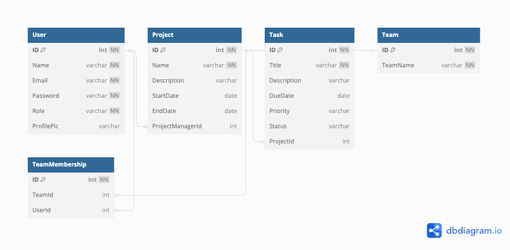

# LinkUp
LinkUp: Simplify teamwork with seamless collaboration, task tracking, and resource optimization. Effortless project management at your fingertips.

# **LinkUp - Comprehensive Project Management Solution**

## **Overview**

LinkUp is a robust project management application designed to streamline collaboration, task tracking, and resource management. This ReadMe guide provides an introduction to LinkUp and helps you get started with its key features and functionalities.

### **Platform Access**

Access the LinkUp platform at [https://vimeo.com/875063300/f386e0e3f2?share=copy]

### **Feature Walkthrough**

Watch our guided video walkthrough: [Link to Feature Walkthrough](https://youtube-link-to-walkthrough/)

### **Key Features**

- **User Management**: Register, login, and manage user roles (Admin, Project Manager, Team Member).
- **Project Management**: Create, edit, and track projects with detailed information.
- **Task Management**: Create, assign, and manage tasks with due dates, priorities, and statuses.
- **Team Management**: Create and manage teams for collaboration.
- **Dashboard**: Get an overview of tasks, project statuses, and team information.
- **Notifications**: Stay updated with real-time or email notifications.
- **Project and Task Analytics**: Monitor project progress and task completion with visual representations.

### **Design Approach and Assumptions**

- Designed for usability and productivity.
- Assumption: Simplified authentication process for the sake of this demo.

### **Installation & Getting Started**

1. Clone the repository: `git clone https://github.com/ksumitcse01/LinkUp.git`
2. Install dependencies: `npm install`
3. Start the application: `npm start`

### **User Journey**

1. Register and log in with provided credentials.
2. Create, manage, and collaborate on projects.
3. Add, edit, and track tasks within projects.
4. Create and manage teams for effective teamwork.
5. Utilize the dashboard for a quick overview of your responsibilities.
6. Stay informed with real-time or email notifications.
7. Monitor project and task analytics for data-driven decisions.

### **ER Diagram**

### **API Endpoints**

### **Authentication**

- **`POST /api/auth/register`** - Register a new user.
- **`POST /api/auth/login`** - Log in an existing user.

### **Projects**

- **`POST /api/projects`** - Create a new project.
- **`GET /api/projects`** - Retrieve all projects.
- **`GET /api/projects/:projectId`** - Retrieve project details.
- **`PUT /api/projects/:projectId`** - Update an existing project.
- **`DELETE /api/projects/:projectId`** - Delete a project.

### **Tasks**

- **`POST /api/tasks`** - Create a new task.
- **`GET /api/tasks`** - Retrieve all tasks.
- **`GET /api/tasks/:taskId`** - Retrieve task details.
- **`PUT /api/tasks/:taskId`** - Update an existing task.
- **`DELETE /api/tasks/:taskId`** - Delete a task.

### **Technology Stack**

- Front-end: Angular
- Back-end: Spring Boot
- Database: MySQL
- Authentication and Security: Spring Security
- Real-time Notifications: WebSocket (or alternative implementation)
- Project Analytics: Visualization library (e.g., Chart.js)

---

Thank you for choosing LinkUp as your project management solution. We hope this guide helps you make the most of our platform. If you have any questions or need assistance, please don't hesitate to reach out to our support team.
